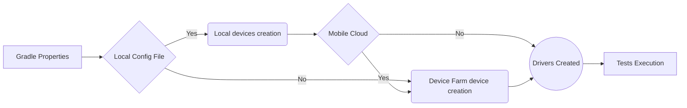

This framework is configured ton be used directly on Eclipse

# Installation for development :

1. Install Eclipse Java with TestNG and Cucumber modules/plugins.

2. Import the project from
   Git

3. Install the Lombok plugin: The installation process may vary depending on your IDE, but you can
   usually find the plugin by searching for "Lombok" in the plugin repository of your IDE. For the
   Eclipse run  `java -jar libs/lombok-1.18.26.jar` and click "Install"
    - Enable Lombok annotation processing: Finally, you'll need to enable Lombok annotation
      processing in your IDE. This will allow your IDE to recognize and handle Lombok annotations
      correctly.

        - IntelliJ IDEA: Open the "Settings" dialog and navigate to "Build, Execution,
          Deployment" > "Compiler" > "Annotation Processors". Check the "Enable annotation
          processing" checkbox and select "Obtain processors from project classpath". Click "Apply"
          and "OK" to save your changes.

        - Eclipse: Open the "Project Properties" dialog and navigate to "Java Compiler" > "
          Annotation Processing". Check the "Enable annotation processing" checkbox and select "
          Enable processing in editor". Click "Apply" and "OK" to save your changes.

# Tests configuration :

* install drivers for all web browsers you want to test
* install appium for mobile tests (Selenium library is included in the framework)
* complete the gradle.properties configuration file

# Configuration gradle.properties file:

* local.properties can be used instead of gradle.properties if both files are presents
  local.properties values will be used

# Auto update IPA into gradle.properties:

To update automatically the IPA within the gradle.properties

* install jq -> `brew install jq`
* connect aws sso -> `aws sso login --profile <your-profile>`
* export -> `export AWS_PROFILE=<your-profile>`
* Run the gradle command : `./gradlew getLatestStagingSauceLabsId`

Then do not forget to commit, push and create the PR for the updated gradle.properties

## Local Settings

- `environment` -> name of the Environment (prod, preprod)

- `storeqa`-> Default store to launch the tests.

- `storeqadata` -> Default store to launch the data consistency tests.

- `order_provider`-> Path of the order file (`./orders/*/order_simple.json`).

- `protocol`-> Protocole used (`https`)

- `language` -> Language to set the Driver (`en`)

- `country` -> Locality to set the Driver (`FR`)

- `proxy` -> Boolean to use a proxy (Not operating : `false`)

- `no_reset` -> Boolean to do not reset the app state before a new session. (`false`)

## Webdriver the Local configuration :

- `web_browser_type` -> Platform driver to use (Example : Chrome, Firefox,...)

- `headless`-> Boolean to show or hide the Webdriver instance (true = hide)

- `web_browser_cloudprovider` -> To use Browserstack (Not operating).

- `browserstack_url_web`-> Browserstack Url.

- `web_Firefox_driver_path` -> Path of Firefox driver (local or CI path)

- `web_Chrome_driver_path` -> Path of Chrome driver (local or CI path)

## Local Device configuration :

Create a device config Json File with
the [Documentation](https://tillersystems.atlassian.net/wiki/spaces/TSR/pages/3088613377/Device+Config+File)

Device :

- `mobile_type`-> Type of the Device (iOS or Android).

- `phone_model` -> Model of the Device.

- `ipa_package_name` -> Name of the Package for the Real Device.

- `app_package_name` -> Name of the Package for the simulator.

## Browserstack Device configuration :

On the file local/gradle.properties :

- `browserstack_username` -> Username Browserstack.

- `browserstack_automate_key` -> Browserstack Automate Key generated.

- `browserstack_url_app` -> Browserstack Url.

- `browserstack_app_id`-> Browserstack App ID (to update when upload new version)

Create a device config Json File with
the [Documentation](https://sumupteam.atlassian.net/wiki/spaces/HQInternalreferential/pages/15691777099/Browserstack+Devices+Config+File)

- `device_name` -> Name of the iOs Device.

- `version` -> Version of the iOs device.

- `buildtype` -> Name of the Browserstack Session.

<details>

<summary>Default Values</summary>

browserstack_username=faycelfrik2<br>

browserstack_automate_key=2LbnxDLz8yoeeyne8xsd<br>

browserstack_url_app=http://hub-cloud.browserstack.com/wd/hub<br>

browserstack_app_id=bs://141d1fa6269b54737541eb1becaeb6b490244178<br>

buildtype=LOCAL TESTS</pre></ul>

</details>

## SauceLabs Device configuration :

On the file local/gradle.properties :

- `saucelabs_url_app` -> SauceLabs Url.

- `saucelabs_app`-> SauceLabs App ID (to update when upload new version)

Create a device config Json File with
the [Documentation](https://sumupteam.atlassian.net/wiki/spaces/HQInternalreferential/pages/21962883095/SauceLabs+Devices+Config+File)

- `device_name` -> Name of the iOs Device.

- `version` -> Version of the iOs device.

- `buildtype` -> Name of the SauceLabs Session.

<details>

<summary>Default Values</summary>

saucelabs_url_app=https://oauth-florian.guilbert-7a7d3:08
b5694f-5d71-4833-9af7-c21d2164d2a6@ondemand.eu-central-1.saucelabs.com:443/wd/hub

saucelabs_app=storage:aeda966d-b78f-4dff-b1db-0623252dad7c

buildtype=LOCAL_TESTS

</details>

<details>

<summary>Default Values</summary>

      "xcodeOrgId": "F9FYC53CJF8J",
      "xcodeSigningId": "iPhone Developer",
      "platformName": "iOS",
      "automationName": "XCUITest",
      "useNewWDA": false,
      "usePrebuiltWDA": true

</details>

## Multi Driver configuration :

When we use a local device and/or multiple Browserstack devices. We have to set the local settings
and the Browserstack settings in order to initiate the driver correctly.

And this will produce a flow chart:




# Tests launch with IntelliJ with Cucumber plugin:

- Install cucumber plugin for Java.
- Tap on Play button on the Feature level to run all the feature.
- Tap on Play button on the Scenario level to run one scenario.


* We can also launch a debug test with breakpoints.


# Cucumber Tests launch with gradle:

To Run a cucumber test with gradle :
Use the following command `gradle clean cucumberTests`~~~~ in command line.

```
gradle clean cucumberTests 
```

You can add properties with "-P".

To launch a particular feature ->

```
gradle clean cucumberTests -Pfeature=xxx.feature
```

To launch a particular tag within a feature ->

```
gradle clean cucumberTests -Pfeature=xxx.feature -Ptags=@xxx
```
